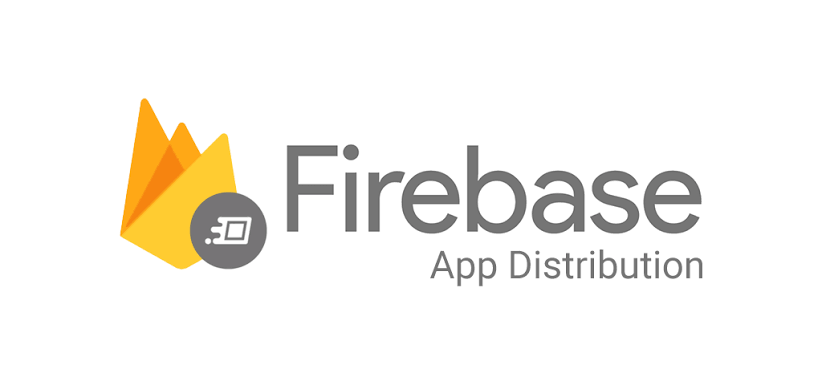

# magic_fitness_app

---

## Getting Started

This project is a starting point for a Flutter application.

A few resources to get you started if this is your first Flutter project:

- [Lab: Write your first Flutter app](https://docs.flutter.dev/get-started/codelab)
- [Cookbook: Useful Flutter samples](https://docs.flutter.dev/cookbook)

For help getting started with Flutter development, view the
[online documentation](https://docs.flutter.dev/), which offers tutorials,
samples, guidance on mobile development, and a full API reference.

---


# Magic Fitness App
**_A basic fitness application built in Flutter that can track a user's workouts._** 

Here, a user can view workouts that they have done and record, edit and delete details of - or an entire - individual workout. 

> It is a test application with no commercial usage.

[]()

<a href="" style="margin: 0;">
    
</a>

This app has two screens:
### 1. List Screen
* Shows a list of all the workouts the user has recorded.
* User is be able to delete any of the recorded workouts.
* Clicking on an item should take the user to the workout screen where they should be able to make edits and change any detail of that recorded workout.

### 2. Individual Screen
* On this screen, the user can record the details of a particular workout, be it a newly created workout or a pre-existing workout.
* They should also be able to select the weight used and the number of repetitions performed.
* A workout consists of one or more sets and each set is made up of one or repetitions.

---

## ARCHITECTURE
> Guides: 
> + [BLoC - Architecture](https://bloclibrary.dev/#/architecture)
> + [Flutter - Reactive Programming - Streams - BLoC](https://www.didierboelens.com/2018/08/reactive-programming-streams-bloc/)

This application implements the [`BLoC`](https://bloclibrary.dev) **(Business Logic Component)** design pattern. This pattern 
seeks to provide a separation of concerns by segmenting the code into discrete sections.

The __*presentation*__ aspects of the application, which represents where an **end user directly interacts** 
with the application, is distinct from the _**business logic**_, which contains the **actual functionality** 
powering the app. 

This approach results in a [modular](https://www.techopedia.com/definition/24771/modular) system that is reusable and facilitates 
[testability](https://en.wikipedia.org/wiki/Software_testability) and [maintainability](https://www.oreilly.com/content/what-is-maintainability/).

With this in mind, the code structure is broken down into the following layers:

### 1. Presentation
> The presentation layer's responsibility is to figure out how to render itself based on prevailing states.<br> 
> In addition, it should handle user input and application lifecycle events.

This layer contains that provide the interface between the end user and application.
The code found here renders the application and handles user input & actions and application lifecycle events.
Presentation is further broken down into the following directories:
+ Views / Screens
+ Widgets
+ Navigation

These folders represent various aspects e.g. the screens a user sees and uses,
supporting widgets/components and the navigation layer for moving from screen to screen.

<h5>(a) Views</h5>

Also known as `Screens`, this folder contains the User Interface code for the various pages that an end user will interact 
with.

Pages found within this folder include
* Home
* Landing
* Login
* Signup

Each page has its own folder and these folders have a common structure of `{page_name}` file, 
`body` file, optional `bloc` file and `components` subfolder. 
This structure utilizes the `part and part of directives` to
allow the constituent parts to be visualized as a single file rather than multiple sections. 

`{Page_name}` represents the specified page e.g. login, `body` has the actual *screen* widget,
`bloc` file which contains implements [<ins>`form_bloc`</ins>](https://giancarlocode.github.io/form_bloc/#/) 
package for easy form state management and 
`components` is a directory consisting of _constituent_ widgets that have specialized functions and 
are included in the main screen widget.
Each form bloc extends *`FormBloc<SuccessResponse, FailureResponse>`* where:
- _`SuccessResponse`_ is the type of the successful response used when the form is submitted successfully.
- *`FailureResponse`* is the type of the failed response used when the form fails to submit.

<h5>(b) Navigation</h5>

This directory contains the code that facilitates movement between and redirection to different screens.
It does this by utilizing the [`go_router`](https://gorouter.dev/) package. Use of the `part of directive`
is employed to allow the code to be processed as one file.

_**x-x-x-x-x-x-x-x-x-x-x-x-x-x-x-x-x-x-x**_

### 2. Business Logic

[](https://bloclibrary.dev)

> The business logic layer's responsibility is to respond to input from the presentation layer with new states.<br> 
> This layer can depend on one or more repositories/controllers to retrieve data needed to build up the application state.

Business or Domain Logic is the part of the program that encodes the real-world operational rules that determine how data can be created, stored, and changed.<br>
Subsequently, this layer acts the bridge between the user interface (*presentation*) and *data* layers. 
It is notified of events/actions from the presentation and then communicates with data 
in order to build a new state for the presentation layer to consume.

It is implemented using the [<ins>bloc</ins>](https://pub.dev/packages/bloc) package and 
is subdivided into:
- `Bloc`s -> Data is received from the presentation layer via `events`.
- `Cubit`s -> Data is received from the presentation layer via `functions`.

Data sent to this layer is forwarded to the controllers where it is processed and returned as result
which is then sent to the UI via `states`.

With regards to naming:
+ Events should be named in the **past tense** because events are *things that have already occurred* from the bloc's perspective.
  * Anatomy is `BlocSubject` + `Noun (optional)` + `Verb (event)`.
  * The base event class should be name: `BlocSubject` + `Event`.
  * Initial load events should follow the convention: `BlocSubject` + `Started`.
+ States should be **nouns** because a state is just a _snapshot_ at a particular point in time.
  + For our app, we shall represent states using single classes which should always be named: `BlocSubject` + `State`.
  + Use the following statuses for the states: `initial` | `success` | `failure` | `loading`.

For generation of `Event` and `State` classes, instead of defining multiple individual event & state classes and extending the abstract class,
we use [<ins>`"Union Types/Sealed Classes"`</ins>](https://pub.dev/packages/freezed#union-types-and-sealed-classes) from [```[freezed]```](https://pub.dev/packages/freezed) package 
to create clean code with **factory constructors** representing the various events/states. Learn more [here](https://www.youtube.com/watch?v=dUc95hhAWLo&t=326s).

_**x-x-x-x-x-x-x-x-x-x-x-x-x-x-x-x-x-x-x**_

### 3. Data
>The data layer's responsibility is to retrieve/manipulate data from one or more sources.

This layer is the lowest level of the application and interacts with databases, network requests, and other asynchronous data sources. 
Additionally, this layer also provides a blueprint/framework with which to structure data/state.

The data layer can be split into the following parts:
* Controllers / Repositories
* Services
* Models
* Extensions
* Constants
* Platform

<h5>(a) Platform</h5>
Place platform dependent code here. As a result, we can provide cross-platform functionality. 
This is done by use of [conditional import/export](https://dart.dev/guides/libraries/create-library-packages)
that check for presence of `dart:io` and `dart:html` libraries and hence serve either web or mobile/server
code depending on which library found with an additional *stub implementation* for platforms that 
support neither library.

<h5>(b) Constants</h5>

This consists of various values that remain unchanged throughout the lifetime of the app. 
They are in turn exported to this folder in keeping with the [`DRY` (*Don't Repeat Yourself*)](https://www.makeuseof.com/tag/basic-programming-principles/)
and imported as needed in other files in this project.

These constants are further arranged in `strings`, `assets` (external files accessed in the app), 
`colors` and `themes`, among others.

This constants provides an additional benefit of allowing easier refactoring if any value needs 
to be changed or, in the case of strings, facilitates translation to multiple languages.

<h5>(c) Extensions</h5>

Extension methods are found in this folder. These methods add functionality to existing libraries.

<h5>(d) Models</h5>

These are classes that act as a blueprints for the app as they define how data is arranged and utilized.
These models are generated using [`freezed`](https://pub.dev/packages/freezed) package with the additional use of [`json_serializable`](https://pub.dev/packages/json_serializable).
These packages provide additional functionality like `copyWith`, `toJson` and `fromJson` methods,
enabling data to be sent and received from APIs and immutable objects to be created, among others.

<h5>(e) Services</h5>

These expose simple APIs like to perform operations like CRUD, network requests, database calls, encryption e.t.c.
Their primary responsibility is to **provide raw data** and they should be _generic_ and _versatile_.

<h5>(f) Controllers</h5>

This layer is a wrapper around one or more services with which the Bloc Layer communicates.
Consequently, classes in this layer can interact with multiple services and perform transformations 
on the data before handing the result to the business logic Layer.

---

## THIRD PARTY PACKAGES
> Source: [Dart packages](https://pub.dev)

A number of external third-party packages have been used in this project to provide extended capability. This include:

+ [**_very_good_analysis_**](https://pub.dev/packages/very_good_analysis):
  + Contains a set of __recommended lints__ for Dart and Flutter (on top of pre-defined linting rules) to encourage good coding practices.
  + These added rules help particularly in _enforcing documentation_ among other scenarios.
  + The lint set provided by the package is  activated in the `analysis_options.yaml` file located at the root of your package.

+ [_**hive**_](https://pub.dev/packages/hive) and [_**hive_generator**_](https://pub.dev/packages/hive_generator)
  + Is blazing fast and lightweight key-value database that is written in pure Dart.
  + Used in-app for persistent storage of workouts.

+ [**_bloc_**](https://pub.dev/packages/bloc):
  + Package that helps to implement the __Business Logic Component__ (*BLOC*) design pattern for separation of code.
  + Partners with **_freezed_** in generation of __events__ (*actions emanating from UI*) and **states** (_data sent from logic_).
  + Further provided and used in:
    + [_**flutter_bloc**_](https://pub.dev/packages/flutter_bloc):
      + Widgets that make it easy to integrate `blocs` and `cubits` into Flutter.
    + [_**hydrated_bloc**_](https://pub.dev/packages/hydrated_bloc):
      + An extension to _package:bloc_ which **automatically persists and restores states** of bloc and cubit.
      + Built on top of **_hive_** for a **`platform-agnostic`**, performant storage layer.
    + [_**form_bloc**_](https://pub.dev/packages/form_bloc) and [_**flutter_form_bloc**_](https://pub.dev/packages/flutter_form_bloc)
      + Facilitate easy form state management using BLoC pattern by separating the form state and business logic from the UI.

+ [**_freezed_**](https://pub.dev/packages/freezed) and [**_freezed_annotation_**](https://pub.dev/packages/freezed_annotation):
  + Used for code generation particularly with regards to data classes **_("models")_**.
  + Implement immutable classes with builtin value equality.
  + Handles (de)serialization compatible and in conjunction with **_json_serializable_**.
  + Used in conjunction with **_bloc_** to generate event and state classes by use of [*Union types and Sealed classes*](https://pub.dev/packages/freezed#union-types-and-sealed-classes).
+ [**_json_serializable_**](https://pub.dev/packages/json_serializable) and [**_json_annotation_**](https://pub.dev/packages/json_annotation)
  + Provides builders for handling **JSON** in application.
  + These builders generate code when finding annotations particularly for custom JSON keys.

+ [**_path_provider_**](https://pub.dev/packages/path_provider):
  + Used to find commonly used locations on the filesystem on native (non-web) platforms.
  + Works in conjunction with **_hydrated_bloc_** to set up the directory for persistent storage and access of states.

+ [**_uuid_**](https://pub.dev/packages/uuid)
  + Implementing generation of unique IDs for workout sessions recorded.

+ [**_intl_**](https://pub.dev/packages/intl)
  + Used for date formatting.
